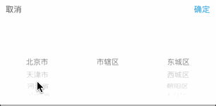

# JCCMapPicker
A map picker widget.

# Usage

## import library

`import "JCCUIKit.h"`

You should download `JCCUIKit` via https://github.com/charsdavy/JCCUIKit .

## Example

### Objc

```objc
- (CIHMapPickerView *)mapPickerView
{
    if (!_mapPickerView) {
        _mapPickerView = [[CIHMapPickerView alloc] init];
        _mapPickerView.delegate = self;
    }
    return _mapPickerView;
}

- (void)hideMapPickerView
{
    if (self.mapPickerView.superview) {
        [self.mapPickerView removeFromSuperview];
    }
}

#pragma mark - CIHMapPickerViewDelegate

- (void)mapPickerViewDidSelectCancel:(CIHMapPickerView *)mapPickerView
{
    [self hideMapPickerView];
}

- (void)mapPickerView:(CIHMapPickerView *)mapPickerView didPickerLocation:(CIHLocation *)location
{
    [self hideMapPickerView];

    NSString *addr = [location addr];
}

```

### Swift

```swift
func showMapPickerView() {
	let mapPicker: MXWMapPickerView = MXWMapPickerView(frame: CGRect(x: 0, y: y, width: 320, height: MXWTimePickerView.height))
	mapPicker.delegate = self
	self.view.addSubview(mapPicker)
}

// MARK: - MXWMapPickerViewCallBack
    
func mapPickerDidTapSubmit(result: MXWLocationModel) {
	let addr: String = result.string()
	closePickerView()
}
    
func mapPickerDidTapCancel() {
	closePickerView()
}
```

# Screenshot

